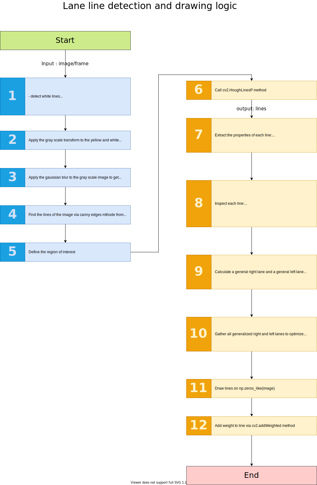

## Lane Finding Pipeline

My solution has two main parts. The diagram below demons
- First 5 steps as demonstrated in the diagram below, are for preparing image for lane line detection processor.
- Second 7 steps are for processing the prepared image to find lines and draw the detected lane lines on the main image.

## Reflection

### 1. Describe your pipeline. As part of the description, explain how you modified the draw_lines() function.

In the first 5 steps of my processor prepare the image which will be used for lane line detection. This image contains only the 

After the 

### 2. Identify potential shortcomings with your current pipeline

One potential shortcoming would be if the road doesn't have lane lines.

### 3. Suggest possible improvements to your pipeline

A possible improvement would be to draw the curves not with the straight lines but with curve lines
